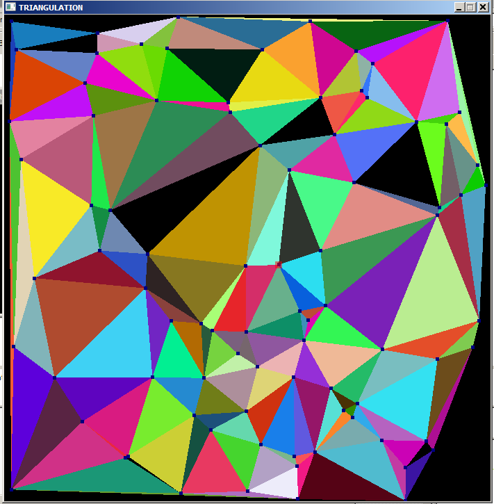

# delaunay triangulation
this is an implementation of the delaunay triangulation using the flip algorithm: 
construct a naive triangulation of the set of points, then flip edges until no triangle is non-delaunay.
a Half-edge data structure is used to represent a triangle mesh.

## Guide

to build the program, run 'code/build.bat' in an environment where 'cl' (Visual Studio compiler) is defined.
the resulting program is inside the 'build' directory.
Upon launch the program generates a random set of 2D points.
Press 'Esc' to compute a naive triangulation of the set.
Press 'Enter' to compute the delaunay triangulation of the set.
You can also move the points by dragging them.

## Screenshots

